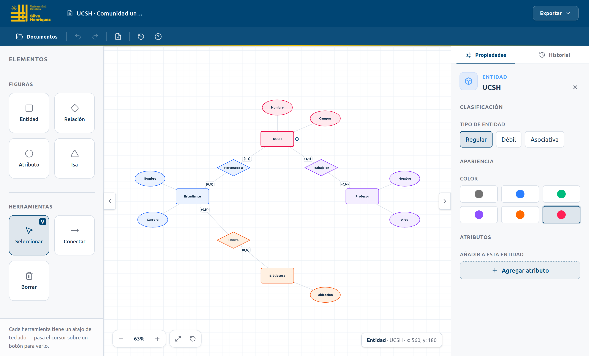

# MER Designer ✨

Un editor visual para crear diagramas **Entidad–Relación (MER)** con la modelado de Peter Chen.

## 🎓 ¿Para qué sirve?

Creado para estudiantes de **Fundamentos a las Bases de Datos**.

Diseña entidades, relaciones y atributos antes de pasar a tablas, claves foráneas o SQL. Ideal para ejercicios, tareas y evaluaciones.

## 🚀 Cómo usarlo

1. Crea las entidades de tu problema.
2. Añade atributos y relaciones.
3. Conecta y organiza el modelo en el canvas.
4. Guarda o exporta tu diagrama.

> Primero entiende los datos. Después construye la base de datos.

